# PVE Tools Pro -- 项目总览

## 项目愿景

PVE Tools Pro 是一个面向 Proxmox VE 9.x 的交互式 Bash 运维工具集。目标是把高频、易错、需要大量人工检查的 PVE 运维动作收口为一个更清晰的菜单驱动工具，配合更严格的校验和更明确的高风险提示，降低误操作概率。

**官网**: https://pve.oowo.cc | **仓库**: https://github.com/PVE-Tools/PVE-Tools-9

## 架构总览

项目已完成模块化重构（v9.0.0），从单一 430KB 脚本拆分为基础设施层（lib/）与功能模块层（src/modules/），通过 build.sh 组装为单文件发布，用户侧零感知。

- **入口层**: `PVE-Tools.sh`（169 行）-- 本地开发时 source lib/ + src/modules/；远程 curl 运行时自动下载 dist/ 构建产物或逐个下载源码模块。
- **基础设施层**: `lib/` -- 全局变量(config.sh)、日志/UI/备份/GRUB(core.sh)、网络检测/镜像选择(network.sh)、运行时守卫(runtime.sh)。
- **功能模块层**: `src/modules/` -- 10 个子目录对应主菜单 1-10 项，每个子目录内按功能拆分文件（init.sh 为菜单入口）。
- **构建系统**: `build.sh` 按顺序拼接 lib/*.sh + src/modules/**/*.sh 为 `dist/PVE-Tools.sh`；`dev.sh` 直接 source 全部源码供开发调试。
- **辅助工具集**: `Tools/` 集成来自 tteck 社区的 13 个系统维护脚本。
- **插件市场**: `Modules/` 提供第三方脚本的自动发现与执行框架。
- **CI/CD**: `.github/workflows/` 提供 release、beta-release、pr-validation 三条流水线。

## 模块结构图

```mermaid
graph TD
    ROOT["PVE Tools Pro (根)"] --> MAIN["PVE-Tools.sh<br/>入口脚本 169行"]
    ROOT --> LIB["lib/<br/>基础设施层"]
    ROOT --> SRC["src/modules/<br/>功能模块层"]
    ROOT --> TOOLS["Tools/"]
    ROOT --> MODS["Modules/"]
    ROOT --> DOCS["Docs/"]
    ROOT --> GHA[".github/"]
    ROOT --> BUILD["build.sh + dev.sh<br/>构建与开发入口"]

    LIB --> LIBC["config.sh<br/>全局变量/镜像/URL"]
    LIB --> LIBCORE["core.sh<br/>颜色/日志/UI/备份/GRUB"]
    LIB --> LIBNET["network.sh<br/>网络检测/镜像选择"]
    LIB --> LIBRUN["runtime.sh<br/>root守卫/调试/PVE检测"]

    SRC --> M01["01-optimization<br/>日常优化与通知"]
    SRC --> M02["02-sources<br/>软件源与系统升级"]
    SRC --> M03["03-boot-kernel<br/>启动与内核管理"]
    SRC --> M04["04-gpu-passthrough<br/>硬件直通与显卡"]
    SRC --> M05["05-vm-container<br/>虚拟机运维与导入"]
    SRC --> M06["06-networking<br/>宿主机网络与防火墙"]
    SRC --> M07["07-storage-disk<br/>存储与磁盘维护"]
    SRC --> M08["08-tools-about<br/>诊断工具与项目信息"]
    SRC --> M09["09-security<br/>安全中心"]
    SRC --> M10["10-third-party<br/>第三方工具"]

    TOOLS --> T1["系统配置: 5个脚本"]
    TOOLS --> T2["容器管理: 3个脚本"]
    TOOLS --> T3["系统维护: 4个脚本"]
    TOOLS --> T4["监控: 1个脚本"]

    MODS --> P1["install-zsh.sh"]
    MODS --> P2["VGPU/*.so"]

    GHA --> W1["workflows/<br/>release/beta/PR"]

    click ROOT "./CLAUDE.md" "返回根文档"
    click LIB "./lib/CLAUDE.md" "查看 lib 模块文档"
    click SRC "./src/CLAUDE.md" "查看 src 模块文档"
    click TOOLS "./Tools/CLAUDE.md" "查看 Tools 模块文档"
    click MODS "./Modules/CLAUDE.md" "查看 Modules 模块文档"
    click GHA "./.github/CLAUDE.md" "查看 CI/CD 模块文档"
```



## 模块索引

| 模块路径 | 语言 | 职责 | 入口文件 | 文档 |
|---|---|---|---|---|
| `/` (根) | Bash | 入口脚本，本地/远程模块加载 | `PVE-Tools.sh` (169行) | `README.md` |
| `lib/` | Bash | 基础设施层：全局变量、日志、UI、网络、运行时 | `config.sh`, `core.sh`, `network.sh`, `runtime.sh` | [lib/CLAUDE.md](./lib/CLAUDE.md) |
| `src/modules/` | Bash | 功能模块层：10 个子模块，对应主菜单 1-10 | 各 `*/init.sh` | [src/CLAUDE.md](./src/CLAUDE.md) |
| `Tools/` | Bash | 第三方系统维护脚本集（13个） | 各 `.sh` 文件 | [Tools/CLAUDE.md](./Tools/CLAUDE.md) |
| `Modules/` | Bash/二进制 | 插件市场与模块 | `install-zsh.sh`, `VGPU/*.so` | [Modules/CLAUDE.md](./Modules/CLAUDE.md) |
| `Docs/` | Markdown | 补充文档与重构计划 | `future-guide.md`, `重构计划-PVE-Tools模块化拆分.md` | -- |
| `.github/` | YAML | CI/CD 工作流与 Issue 模板 | `workflows/*.yml` | [.github/CLAUDE.md](./.github/CLAUDE.md) |

## 技术栈

| 层面 | 技术 | 版本/说明 |
|---|---|---|
| 运行环境 | Proxmox VE 9.x (Debian 13 Trixie) | 要求 root 权限 |
| 主脚本语言 | GNU Bash | 模块化源码；通过 build.sh 组装为单文件分发 |
| 构建系统 | bash + find + sort | `build.sh` 顺序拼接 lib/ -> src/modules/ -> dist/PVE-Tools.sh |
| 开发模式 | bash dev.sh | 直接 source 全部源文件，无需构建 |
| CI/CD | GitHub Actions | release / beta-release / PR validation |
| 编译工具 | shc | 将 dist/PVE-Tools.sh 编译为二进制（仅 release 流程） |
| 许可证 | GPL-3.0 | 详见 `LICENSE` |

## 运行与开发

### 用户使用

```bash
# Cloudflare 短域名（推荐）
bash <(curl -sSL https://pve.oowo.cc/PVE-Tools.sh)

# 中国大陆网络
bash <(curl -sSL https://ghfast.top/raw.githubusercontent.com/PVE-Tools/PVE-Tools-9/main/PVE-Tools.sh)

# 本地开发
bash dev.sh
```

### 开发工作流

```bash
# 改代码 -> 直接运行验证
bash dev.sh

# 确认改好了 -> 构建单文件
bash build.sh

# 验证构建产物
bash dist/PVE-Tools.sh

# 静态检查
bash -n PVE-Tools.sh
bash -n dist/PVE-Tools.sh
shellcheck -f gcc PVE-Tools.sh
shellcheck -f gcc dist/PVE-Tools.sh
```

### 构建原理

`build.sh` 按以下固定顺序拼接：
1. `lib/config.sh` -- 全局变量定义（必须最先加载）
2. `lib/core.sh` -- 日志/UI/备份/GRUB（依赖 config.sh 中的变量）
3. `lib/network.sh` -- 网络检测/镜像选择
4. `lib/runtime.sh` -- 运行时守卫/main()函数
5. `src/modules/**/*.sh` -- 按路径名排序（`sort -z`），确保 init.sh 先于同目录其他文件加载

### CI/CD 流水线

- **PR 合并到 main/beta**: 触发 shellcheck、Bash 语法检查、版本一致性校验、安全扫描。
- **推送版本标签 (v*.*.*)**: 触发 Release 工作流，先执行 `bash build.sh` 构建，再用 shc 编译二进制，自动生成 GitHub Release。
- **推送 beta/alpha 标签**: 触发 Beta Release 工作流。

## 测试策略

| 类型 | 方式 | 说明 |
|---|---|---|
| 语法检查 | `bash -n PVE-Tools.sh`、`bash -n dist/PVE-Tools.sh` | CI 中强制通过 |
| 静态分析 | `shellcheck -f gcc PVE-Tools.sh` | CI 中强制通过，需额外关注多文件 source 模式 |
| 版本一致性 | 比较脚本内 `CURRENT_VERSION` 与 `VERSION` 文件 | CI 中强制通过 |
| 安全扫描 | 检测 `eval`/`source` 使用 | CI 中告警 |
| 功能测试 | 手动在 PVE 9.x 环境验证 | 无自动化 E2E 测试 |

**注意**: 本项目目前没有自动化单元测试或集成测试。所有功能验证依赖人工在真实或模拟的 PVE 9.x 环境中测试。模块化后，建议在每次 PR 时同时验证 `bash dev.sh` 和 `bash build.sh && bash dist/PVE-Tools.sh` 的行为一致性。

## 编码规范

### Bash 脚本规范

- Shebang: `#!/bin/bash`
- 版权声明: 每个文件头部包含 `# SPDX-License-Identifier: GPL-3.0-only` 和 `# Copyright (C) 2026 Ciriu Networks`
- 缩进: 4 空格
- 函数命名: `snake_case`（如 `vm_validate_new_vmid`、`host_network_get_bridges`）
- 变量命名: `UPPER_SNAKE`（全局配置常量）、`lower_case`（局部变量）
- 颜色: 通过 `setup_colors()` 统一管理 ANSI 颜色变量，兼容 `NO_COLOR` 环境变量
- 日志: 使用统一日志函数 `log_info`、`log_warn`、`log_error`、`log_step`、`log_success`、`log_tips`
- UI: 使用 `UI_BORDER`、`UI_DIVIDER`、`UI_HEADER`、`UI_FOOTER` 统一边框风格
- 风险控制: 高风险写入操作必须使用 `confirm_high_risk_action()` 要求输入确认词
- 配置备份: 修改系统配置文件前调用 `backup_file()` 自动备份到 `/var/backups/pve-tools/`
- 幂等性: GRUB 参数等配置通过专用幂等管理函数修改，支持增删查
- 日志文件: 所有操作记录到 `/var/log/pve-tools.log`
- 模块加载: `lib/` 按 config -> core -> network -> runtime 固定顺序加载；`src/modules/` 按文件名排序

## AI 使用指引

- **模块理解**: 优先阅读各模块的 `CLAUDE.md` 而非直接扫描源代码。
- **入口分析**: `PVE-Tools.sh` 仅 169 行，可完整阅读。核心逻辑为 `pve_tools_entry_source_tree()` 和 `pve_tools_entry_prepare_remote_tree()`。
- **基础设施分析**: `lib/core.sh` 包含所有日志/UI/备份/GRUB 函数（约 500 行）；`lib/runtime.sh` 包含 `main()` 函数（约 235 行）。
- **功能模块分析**: `src/modules/` 下每个子目录的 `init.sh` 为菜单入口函数，其他文件为具体功能实现。
- **忽略的构建产物**: `dist/`、`node_modules/`、`.vitepress/dist/`、`.vitepress/cache/` 均被 `.gitignore` 忽略且不参与分析。
- **二进制文件**: `Modules/VGPU/*.so` 只记录路径，不读取内容。
- **已移除模块**: `Web/` 目录及其 VitePress 文档站已于本次重构中移除。

## 变更记录 (Changelog)

| 日期 | 变更 | 来源 |
|---|---|---|
| 2026-07-08 | 重大更新：项目模块化重构完成。430KB 单文件拆分为 lib/ (4文件) + src/modules/ (10子模块, ~60文件)。新增 build.sh/dev.sh 构建系统。Web/ 目录已移除。更新全部 CLAUDE.md 文档体系。 | claude-init 架构师（自适应版） |
| 2026-04-28 | 初始化 CLAUDE.md 体系（根 + Web + Tools + Modules） | claude-init 架构师（自适应版） |
